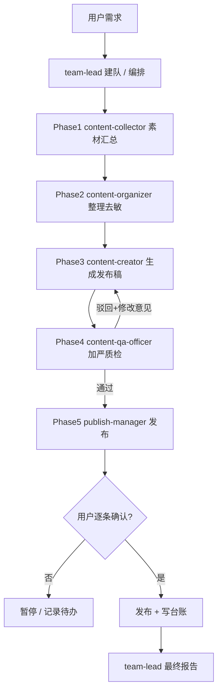

# Workflow（工作流）

## 编排总览

## 阶段步骤

### Phase 1 — 素材汇总（content-collector）
- 采集用户指定来源：本地文件、工作成果、各渠道历史内容、需求清单
- 输出《素材汇总池》：按来源 / 时间 / 用途结构化，每条可溯源

### Phase 2 — 内容整理（content-organizer）
- 接收 Phase 1 完整原文，去敏（本地路径 → 占位符）、分类、规范命名、带版本号
- 输出《待生成内容包》

### Phase 3 — 内容生成（content-creator）
- 按目标渠道规格生成，适配各平台格式与语气
- 输出《发布稿 v{版本号}》：标题 / 正文 / 渠道适配说明

### Phase 4 — 加严质检（content-qa-officer）★ 质检门禁
- 检查项：基础质量 + 敏感扫描 + 发布清单 + 版权三件套 + 合规审查 + 身份隔离 + 竞品对照
- 输出《质检报告》：结论必须为「通过」或「驳回 + 修改意见」
- **未通过 → 回退 Phase 3，按修改意见重做，不得进入 Phase 5**

### Phase 5 — 发布执行（publish-manager）★ 确认门禁
- 先向用户逐条确认「发什么 / 发到哪 / 版本号」，获明确同意
- 执行多渠道发布，输出《发布记录》：渠道 / 时间 / 链接 / 版本 / 状态
- **未经确认不得发布**

### 最终 — team-lead 签发
- 综合质检报告 + 发布记录，向用户输出：内容摘要 / 质检结论 / 发布结果 / 后续建议

### 单阶段短路（W2 / W3 / W4）
- **W2 发布前加严检查**：用户已有成稿 → 仅跑 Phase 4（content-qa-officer）→ 输出《质检报告》。通过后可接 W3。
- **W3 快速发布**：内容已通过质检（有通过报告或用户明确确认）→ 仅跑 Phase 5（publish-manager）。发布前仍须走 G2 确认门禁。
- **W4 发布台账管理**：仅由 publish-manager 查《发布记录》或 team-lead 读台账文件，汇总成发布历史报告。

## 质量门禁（Gate）
- **G1 质检门禁（铁门禁①）**：Phase 4 结论 ==「通过」才放行 Phase 5
- **G2 确认门禁（铁门禁②）**：Phase 5 发布前用户明确同意
- **G3 链路纪律（内部）**：每阶段完整原文转交下一阶段，不得跳级、不得互连；属可靠性纪律，非对外门禁

> 两条「铁门禁」（G1 质检、G2 确认）是面向用户的不可绕过承诺；G3 是内部链路纪律，由 bind.md 第 2/4 条约束。
